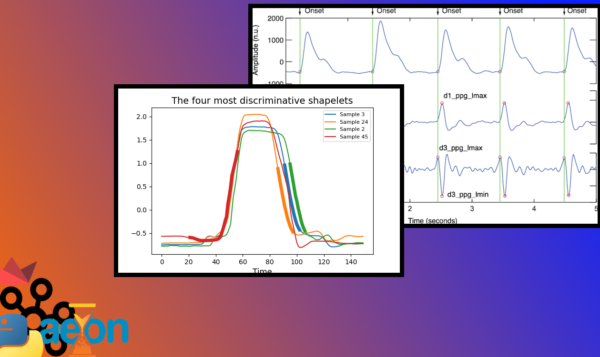

Репозиторий реализует инференс модели шейплетной классификации данных с медицинского прибора.

2 продюсера (producers/dataloadr.py) подбирают данные из разных csv файлов, через брокер они попадают в препроцессинг (consumers/preprocessor.py), оттуда фильрованые данные с закодированными лейблами попадают в воркер с моделью (consumers/classifier.py), и наконец метрика считается и отображается графически в плотере (consumers/plotter.py).
Скрипты загрузки парамтеризованы батч сайзом и путями к данным(в лоудере); консюмеры по потребности подгружают гтовые чекпоинты модели и лейбл-энкодера (они предварительно готовятся в ml/train.py; там же и сиходные файлы МЛ-составляющих).

Для запуска скрипта используется run_pipe.sh, для остановки stop_pipe.sh; run_pipe.sh автоматически подгружает в венве, распололоженнос в директории (не создан предварительно) нужные библиотеки, точка запуска - текущая директория (kafka_ml).
