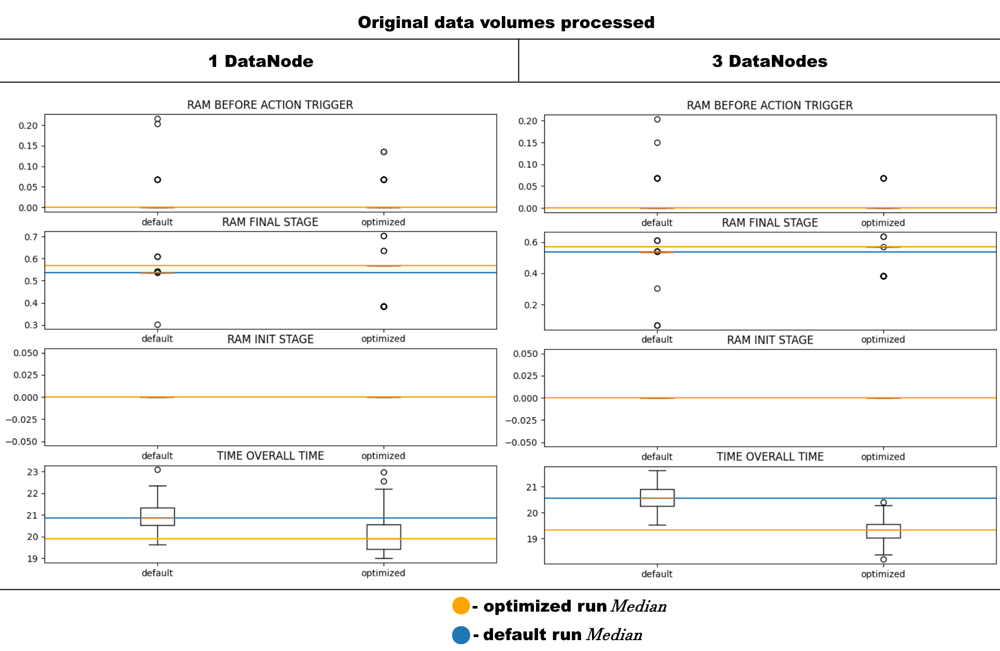
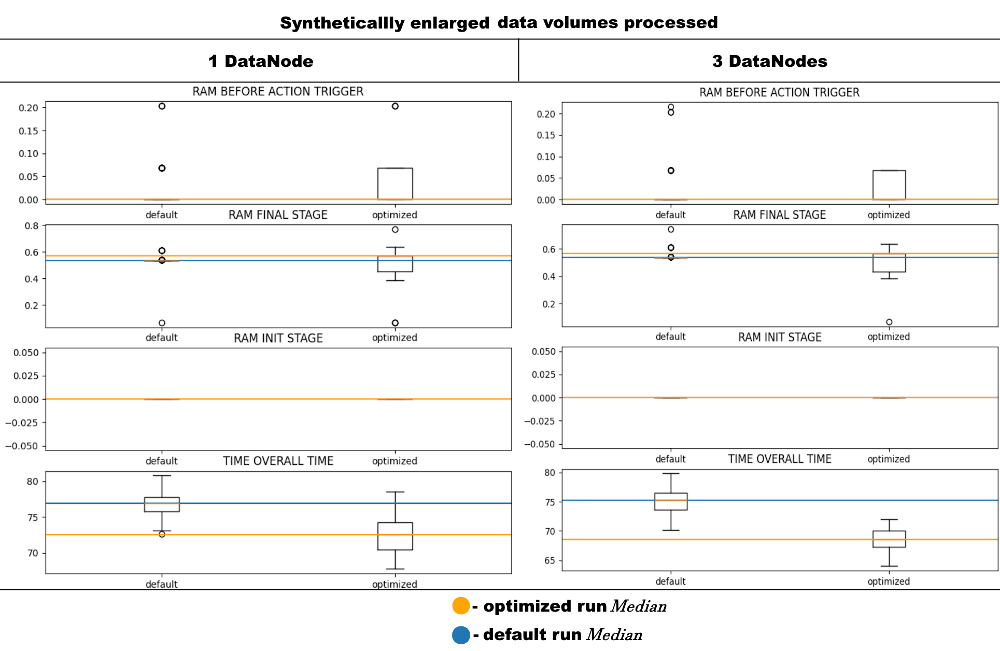

# 🐍PySpark✨ on 📂Hadoop🐘 feat.⚡️Scala⚡️ for 🩺PPG data processing🫀 
### 👉 [🩺🫀🗃️ → 🐘⭐ → 📊](init.sh) 👈

<!--
4. В приложении применены 2 оптимизаци - репартицирование и вызов skala-udf (исходные коды и результаты сборки sbt в src/skala/iirf/*; не все результаты работы перенесены, но снапшот-jar загружен) вместо python-udf. 
-->

## Data Set [🩺🫀🗃️]: 
The task is based on synthetical dataset containing timeserieses describing PPG data from medical device published at https://www.kaggle.com/datasets/ucimachinelearning/photoplethysmography-ppg-dataset. It also contains labeling for normal mediacl condition and MI case. 

To asses the applicability of ad hoc spark application the duplicated version of data is also present. Here and after when the original data split is considered (~300 MB of data), the work done with duplicated data (~3GB) is marked with '*_XXL*' suffix.

## Data Processing [🐘⭐] Spark application.
👉[The application](./src/run.py) is written in PySpark on Hadoop inside Docker Containers🐋 resembling name and data nodes.  
Pipeline applies 👉[**IIR filtering** and **label encoding**](../kafka_ml/) to PPG timeserieses and pathology/normal medical conditions labeling present in the dataset respectively.

### The Setup [⚙️📂]: Spark on Hadoop
Hadoop runs in two setups:
1. 👉[**1x**Name Node + **1x**Data Node](./compose_singlenode_spark.yml)
2. 👉[**1x**Name Node + **3x**Data Node](./compose_multinode_spark.yml)

Them both are generally tuned by 👉[hadoop environment configuration](./hadoop_cfg.env).
The setup is configured by associated .yml file as it is passed as a *positional arg* to 👉[initialization script](./init.sh)

Run starups are incopsulted inside *run_experiments\** shell scripts (e.g. 👉[this script](./run_experements_single_node.sh)) for automated logs collections for further performance assesment.

The script is run via spark submit, ignoring default startup options for Spark on Hadoop, the run is controlled by the following arguments:

> ***--pth*** path to data (default or XXL)  
***--dbg*** flag that enables debugging (not used inside experiments runs)  
***--opt*** flag switching default version of script to the one, involving perfomance optimizations  
***--jars*** path argument for including side precompiled jvm executables (used for optimization in the next section)  

### Optimization [🧩⚡️]: Partitioning and efficient functions

In order to optimize the run two optimizations are presented:

1. Before application of trandforms the dataframe is repartitioned to comply with *sparkContext.defaultParallelism* as seen 

2. The IIRF is also implented in Scala PL as seen 👉[here](.src/scala/iirf/src/main/scala/Main.scala). Precompiled jar (via [sbt](https://www.scala-sbt.org/), the snapshot is placed inside an 👉[ad hoc folder](./src/scala/)) is loaded through source path as a ***--jars***  flag in initialization and is registered as UDF.

For additional details look inside the 👉[main script](./src/run.py) comments.

## Graphs [📊]: The statistically viable reluslts on efficiency.

The results for different data versions and algorithm setups were derived **100 times** each.

Reults are the following:
For original data:

For synthetically enlarged data:

They are computed inside 👉[this script](./plots.ipynb). 

The script collects output logs from main script runs and executes statistics computation and plotting.